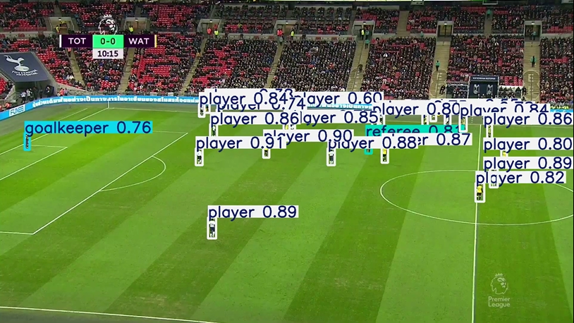

# Detecção de Jogadores e Bola em Partidas de Futebol com YOLOv8

Este projeto tem como objetivo detectar jogadores e a bola de futebol em vídeos de partidas usando o modelo YOLOv8.

## Objetivo
Treinar um modelo YOLOv8 para identificar jogadores e a bola em vídeos de futebol, com posterior aplicação em trechos de vídeo para visualização dos resultados.

## Tecnologias e Ferramentas
- Python 3.10+
- Ultralytics YOLOv8
- OpenCV
- Google Colab / Jupyter
- Roboflow

## Etapas do Projeto
- Coleta e anotação de dados de partidas de futebol
- Treinamento do modelo YOLOv8 em Colab
- Avaliação com métricas de precisão (mAP)
- Aplicação do modelo em vídeos de teste
- Visualização de resultados com bounding boxes

## Conhecimentos Aplicados
- Visão Computacional e Deep Learning
- Detecção de Objetos com YOLOv8
- Pré-processamento de dados para modelos de detecção
- Análise de métricas (confiança, IoU, mAP)
- Manipulação de vídeo com OpenCV

## Exemplo de Resultado

